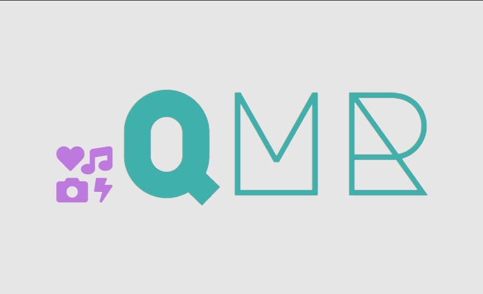

<h1 align="center">Quarantine Media Recommender</h1>

    
    
    
    
    

    

<h2 align="center">
    <a href="https://brianrshort.github.io/trilogy-project-one/">=> Live Demo <=</a>
</h2>
 

<h2>Project Requirements</h2>
<ol>
    <li>Must use at least two server-side APIs</li>
    <li>Must use a CSS framework other than Bootstrap</li>
    <li>Must use client-side storage to store persistent data</li>
    <li>Must have a polished, mobile-first UI</li>
    <li>Must meet good quality coding standards (indentation, scoping, naming, etc.)</li>
    <li>Does NOT use alerts, confirms, or prompts (look into modals)</li>
    <li>Must be deployed to GitHub Pages</li>
    <li>Must be interactive (i.e: accept and responf to user input)</li>
</ol>
 

<h2>Description</h2>

We get it. You're bored.

There's only so many times you can re-watch
Homecoming or Love is Blind or whatever while you're
working, living, and connecting remotely.

The Quarantine Media Recommender (QMR) can help.
You type in your topic of interest and the QMR delivers a
list of books, movies, or songs to explore while you're
waiting for your groceries to get delivered.

There's also a handy review section that stores your
reviews and ratings so you can remember what you
thought when you watched Tiger King the first time.

 

<h2 align="center">
    
</h2>
 

<h2>How to Use</h2>
<ol>
    <li>Decide on a topic to search and enter it into the search field in the yellow section. Tip: If you can't think of a topic, try out our randomly suggested topics in pink.</li>
     
    <li>Select the media type that you'd like to search; books, movies, or songs.</li>
     
    <li>Click search to view the results in the grey section. Hint; you can click on the details section of movie results to view the movie details on the IMBD website.</li>
     
    <li>Leave a review in the green section to keep track of what you thought about all of the media you've soaked up.</li>
</ol>
 

<h2>Contributors</h2>
<ul>
    <li>@stricklin927</li>
        <ul>
            <li>HTML</li>
            <li>CSS</li>
            <li>Foundation</li>
        </ul>
    <li>@bettycode</li>
        <ul>
            <li>Displaying API Objects Dynamically</li>
            <li>IMBD Links</li>
        </ul>
    <li>@brianshort</li>
        <ul>
            <li>Ratings & Reviews (input, display, localstorage)</li>
            <li>Random Topic Function</li>
        </ul>
    <li>@jsegnegon</li>
        <ul>
            <li>Suggestion Box</li>
        </ul>
    <li>@sambishop3015</li>
        <ul>
            <li>Get Functions for APIs</li>
            <li>README</li>
        </ul>
</ul>
 

<h2>Lessons Learned</h2>
<ul>
    <li>@stricklin927:</li>
    <li>@bettycode:</li>
        <ul>
            <li>Working with other developers</li>
            <li>Understanding the workflow</li>
        </ul>
    <li>@brianshort:</li>
        <ul>
            <li>Increased fluency with API objects</li>
            <li>Git collaboration methods</li>
        </ul>
    <li>@jsegnegon:</li>
    <li>@sambishop3015:</li>
        <ul>
            <li>API types; HTML, OAuth, Key</li>
            <li>Readme design tricks including gifs</li>
            <li>Working with developers and using Git branches</li>
        </ul>
</ul>
